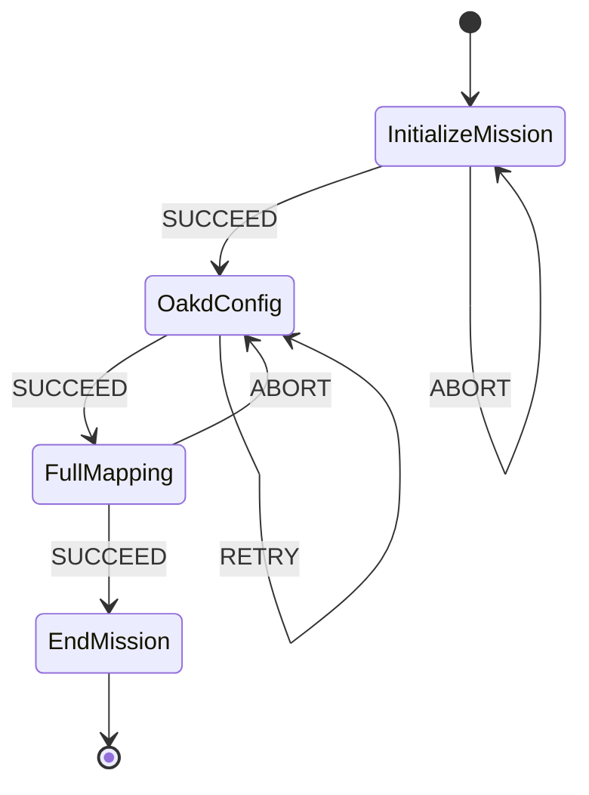
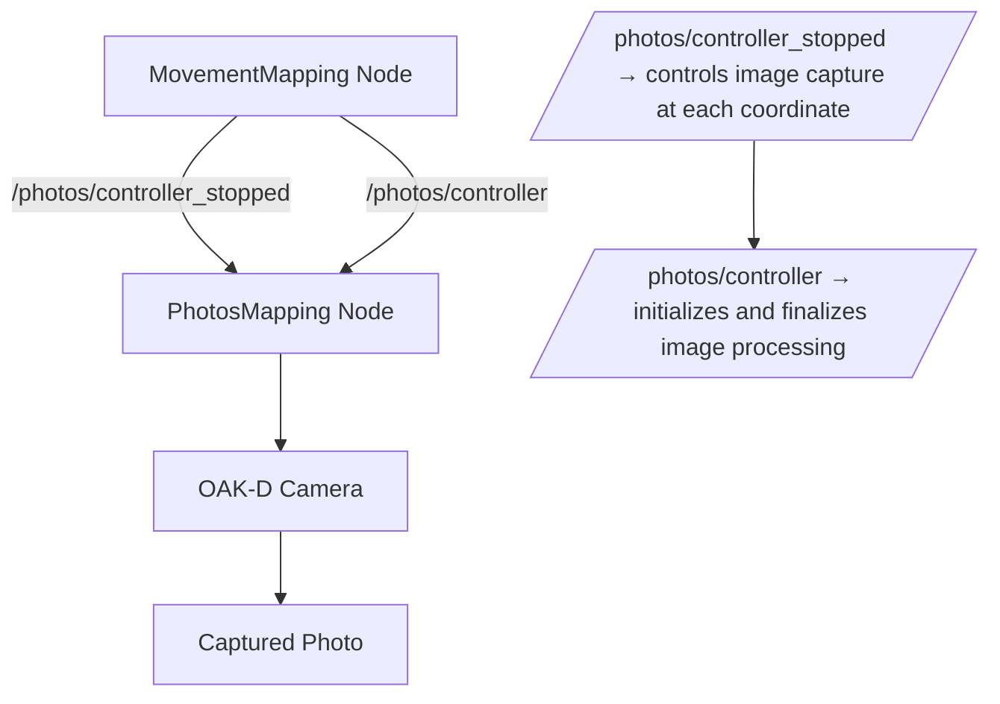
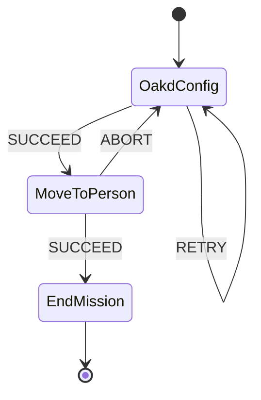

# IMAV 2025: OUTDOOR MISSIONS

This repository implements a modular state-machine framework for autonomous drone missions using ROS 2, Yasmin, MAVROS, and DepthAI (OAK-D Lite). It provides the first two complete mission pipelines for outdoor category tasks from IMAV (International Micro Air Vehicle Conference and Competition) 2025: Mapping Mission — GPS-based autonomous mapping and photo acquisition; and Find-a-Person Mission — real-time person detection and localization using the OAK-D spatial neural network. Both missions share a common architecture based on the Yasmin State Machine, ensuring recoverable behavior, modularity, and mission persistence.

## Repository Structure

```
outdoor/
│
├── mapping/
│ ├── states/
│ │ ├── basic_states.py
│ │ ├── full_mapping.py
│ │ └── constants.py
│ ├── mapping_sm.py
│ ├── movement_mapping.py
│ └── photos_mapping.py
│
└── find_a_person/
├── states/
│ ├── oakd_config.py
│ ├── move_to_person.py
│ ├── initialize_end.py
│ └── constants.py
└── lets_bora.py

```

## Mapping Mission

### State machine based option

The Mapping Mission based on YASMIN state machine structure performs a fully autonomous flight along predefined GPS coordinates, taking photos at each waypoint. It is robust to OAK-D failures — if the camera disconnects, the system transitions back to OakdConfig and reinitializes before continuing.



| State | Description |
|--------|--------------|
| InitializeMission | Arms the drone and performs take-off to a defined altitude (ALTITUDE = 60 m). |
| OakdConfig | Initializes the OAK-D Lite camera using mirela_sdk.image_processing.OakdCam. |
| FullMapping | Moves to each coordinate, takes a photo, and stores it under mapping_photos/. Coordinates already visited are set to None to ensure persistence between retries. |
| EndMission | Executes Return-to-Launch (RTL) and finalizes the mission. |

#### Execution

```bash
ros2 run outdoor full_mapping
```

### ROS2 Topic based option

In addition to the state-machine-based implementation, the Mapping Mission can also be executed through a **ROS 2 topic-driven architecture**, allowing for greater modularity and real-time control between nodes.  
In this approach, mission execution is divided into **two main nodes** that communicate asynchronously via **ROS 2 topics**:

1. **`MovementMapping` node** — responsible for drone navigation, flight control, and publication of mission status messages.  
2. **`PhotosMapping` node** — responsible for receiving control messages, capturing images through the OAK-D camera, and saving them with incremental naming.

#### Communication flow

The nodes interact through the following topics:

| Topic | Message Type | Publisher | Subscriber | Description |
|-------|---------------|------------|-------------|--------------|
| `/photos/controller` | `mavros_msgs/LogData` | `MovementMapping` | `PhotosMapping` | Triggers the start or end of the photo capture process. |
| `/photos/controller_stopped` | `mavros_msgs/LogData` | `MovementMapping` | `PhotosMapping` | Indicates that the drone has reached a waypoint and that a photo should be captured. |

The sequence begins when the drone arms, takes off, and flies to the first waypoint.  
For each GPS coordinate, the **`MovementMapping`** node publishes a message to `/photos/controller_stopped`, signaling the **`PhotosMapping`** node to capture an image via the `ImageHandler`.  
After the photo is saved, the mission continues to the next coordinate until completion, when the `MovementMapping` node publishes a final termination message to `/photos/controller`.

#### ROS 2 flow diagram



#### Characteristics

- **Decoupled operation** — Each node runs independently, communicating solely via topics. This allows the camera and drone processes to operate on separate devices if needed.  
- **Event-driven synchronization** — Photo capture is triggered by the arrival of a specific ROS message, eliminating the need for tight coupling or sequential blocking calls.  
- **Operational assumption** — This variant **does not implement OAK‑D reinitialization**. Unlike the YASMIN state-machine option, it assumes the camera and the nodes remain healthy throughout the mission. If the camera or a node crashes, restarting the affected node or adding an external supervisor/watchdog is required. 
- **Scalability** — The topic-based communication structure enables integration with additional nodes (e.g., for mapping stitching, data processing, or live telemetry visualization).

#### Execution

The topic-based Mapping Mission can be executed either by launching each node in separate terminals or through a unified ROS 2 launch file that automates both processes.

**Option 1 – Manual execution**

```bash
# Terminal 1: Flight control and message publication
ros2 run outdoor movement_mapping

# Terminal 2: Photo capture and image storage
ros2 run outdoor photos_mapping
```

This method allows for independent monitoring and debugging of each node.

**Option 2 – Launch file**

A dedicated launch file is also available to start both nodes simultaneously, ensuring proper initialization order and topic registration.

```bash
ros2 launch outdoor mapping_topic.launch.py
```

The launch file automatically:
- Initializes the **MovementMapping** and **PhotosMapping** nodes in sequence.  
- Ensures that publishers and subscribers are synchronized before mission start.  
- Redirects standard output logs for both nodes into the ROS 2 logging system for consolidated monitoring.  

This approach simplifies deployment on embedded systems or field setups where the mission must start its entire application with a single command.


#### Summary

This architecture allows the application to be divided into two independent nodes, one for flight control and another for image acquisition, enabling concurrent execution and full exploitation of ROS 2 parallelism for efficient resource utilization across different processes.
## Find-a-Person Mission

The Find-a-Person Mission enables the drone to detect and approach a person in its field of view using the OAK-D spatial detection model. It demonstrates real-time computer vision and drone coordination within a recovery-capable Yasmin state machine.



| State | Description |
|--------|--------------|
| OakdConfig | Loads a DepthAI ssd_mobilenet.blob model and initializes neural queues. |
| MoveToPerson | Performs continuous detection, displays bounding boxes, and centralizes the drone over the detected person. |
| EndMission | Safely stops the mission and performs final cleanup. |

### Execution

```bash
ros2 run outdoor find_a_person
```

During execution, pressing `q` closes the detection window and safely stops the camera node.


## Core Architecture

The core architecture of this project is composed of a set of ROS 2 modules and helper classes that form the backbone of both mission types.  
This section describes the key components imported and reused across the **Mapping Mission** and **Find-a-Person Mission**, explaining how each contributes to flight control, camera management, and state synchronization.

| Component | Description |
|------------|-------------|
| **YasminNode** | Provides the base ROS 2 node used for all YASMIN states. It manages communication with the ROS graph, handles state transitions, and centralizes logging for mission feedback. |
| **MavDrone** | A MAVROS-based control interface that abstracts drone commands such as arming, take-off, GPS-based navigation, and Return-to-Launch (RTL). It ensures reliable offboard operation and synchronization with autopilot messages. |
| **OakdCam** | DepthAI camera interface responsible for initializing, configuring, and streaming RGB and depth data. It also handles neural inference pipelines when spatial detection networks are used. |
| **ImageHandler** | Manages image acquisition callbacks and storage routines. It connects the OAK-D camera stream to the photo-saving logic used in the ROS2 topic based mapping mission |


## Requirements:

**Open modules**:
- ```Python ≥ 3.10  ```
- ```ROS2 ```
- ```MAVROS and MAVLink installed  ```
- ```DepthAI SDK (depthai)  ```
- ```Yasmin ≥ 1.3  ```
- ```OpenCV ≥ 4.8  ```

**Proprietary modules**:
- ```mirela_sdk``` (by Black Bee Drones team)


## Citation and Credits

This project was developed by **Eduardo Castro** as part of the **VisCap Laboratory (UNIFEI)** research group, focused on autonomous drone vision and embedded AI systems. It integrates work on embedded inference using OAK-D Lite, MAVROS, and the Yasmin framework for mission orchestration.

If you use this project in research, please cite:

```
@inproceedings{castro2025autonomous,
  title={Autonomous Drone Missions with ROS 2, Yasmin and DepthAI},
  author={Eduardo Castro},
  year={2025},
  institution={Universidade Federal de Itajubá (UNIFEI)}
}
```

## License

This repository is released under the MIT License. See LICENSE for details.